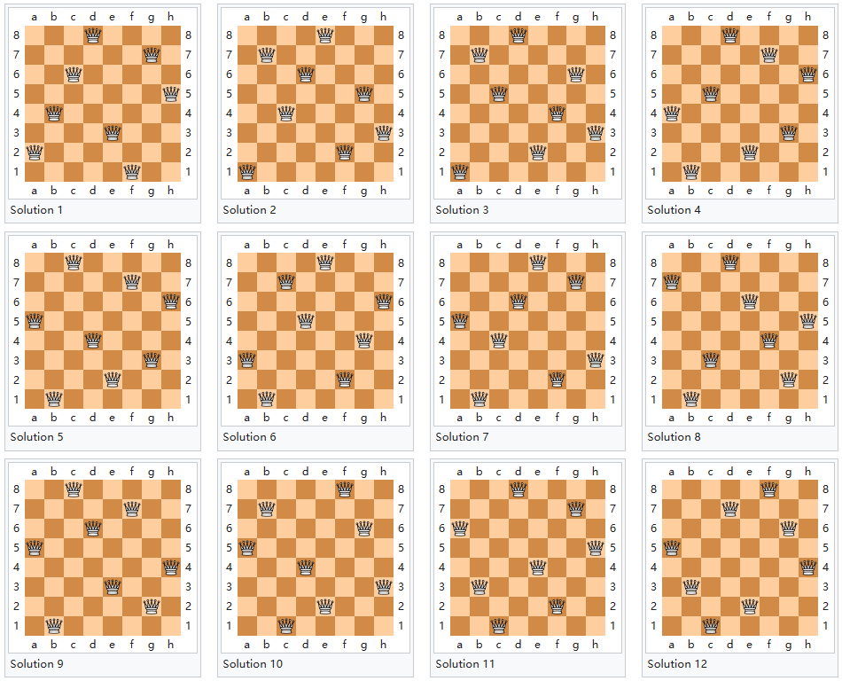
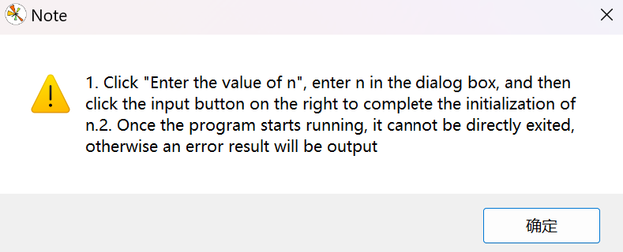
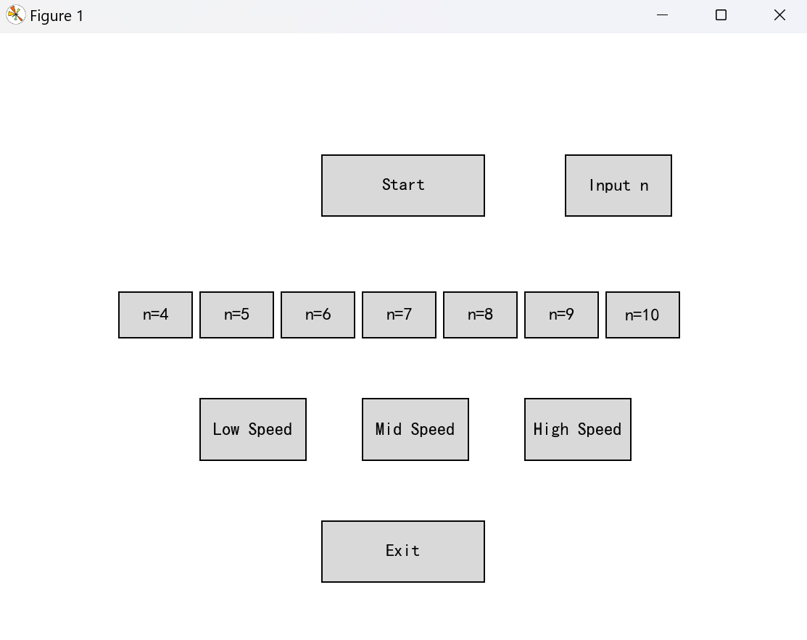
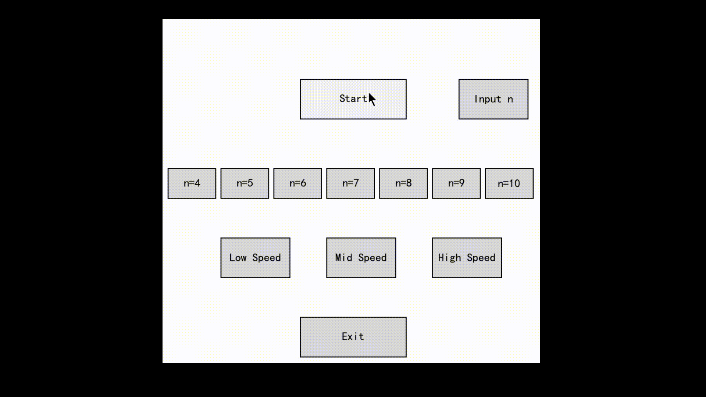

# Eight queens puzzle visualized by matplotlib and tkinter
***Author***: Shiwei Liu, [College of Artificial Intelligence, Nankai University](https://aien.nankai.edu.cn/)

***E-mail***: 2011832@mail.nankai.edu.cn

## About this program
This project is my final assignment for the course "Artificial Intelligence Technology" during my junior year(2022) at Nankai University.It is used to visualize the result and process of "Eight Queens Puzzle". The eight queens puzzle is the problem of placing eight chess queens on an 8×8 chessboard so that no two queens threaten each other; thus, a solution requires that no two queens share the same row, column, or diagonal. I programmed this to find all of the solution of this puzzle, and I also expand this to "N Queesn Puzzle Solution" which could arrange n queens to a chessboard.


## Requirements
1. You need a [conda](https://www.anaconda.com) enviroment with a suitable Python version:
    ```
    conda create -n YOUR_ENV_NAME python==3.9
    conda activate YOUR_ENV_NAME
    ```
2. Install matplotlib and tkinter by running:
    ```
    pip install matplotlib
    pip install tkinter
    ```
## How to use 
1. Run this command to get started:
   ```
   python 8_Queen_Visualization.py
   ```
2. After activate this program, you will get a notice:

3. Click button "ok" and get a figure in your screen. You can set numbers of queens and the rendering speed:
 
4. Click button "start" and you will get solution videos:
